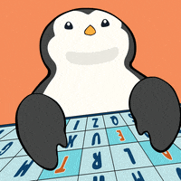

<link rel="preconnect" href="https://fonts.googleapis.com">
<link rel="preconnect" href="https://fonts.gstatic.com" crossorigin>
<link href="https://fonts.googleapis.com/css2?family=Alumni+Sans+Pinstripe:ital@0;1&family=Doto:wght@100..900&family=Funnel+Display:wght@300..800&family=Open+Sans:ital,wght@0,300..800;1,300..800&family=Orbitron:wght@400..900&display=swap" rel="stylesheet">
    <meta charset="UTF-8">
    <meta name="viewport" content="width=device-width, initial-scale=1.0">
<body style='padding: 16px;'>

<h1 align='center'><a style='color: white; font-family: "Orbitron", serif;'> <b>Hi</b> 
 👋 <b>I'm Nikunj Chauhan</b></a></h1>

<h6  align='center' style='color: white; font-family: "Orbitron", serif;'>A Student</h6>

    

</body>

